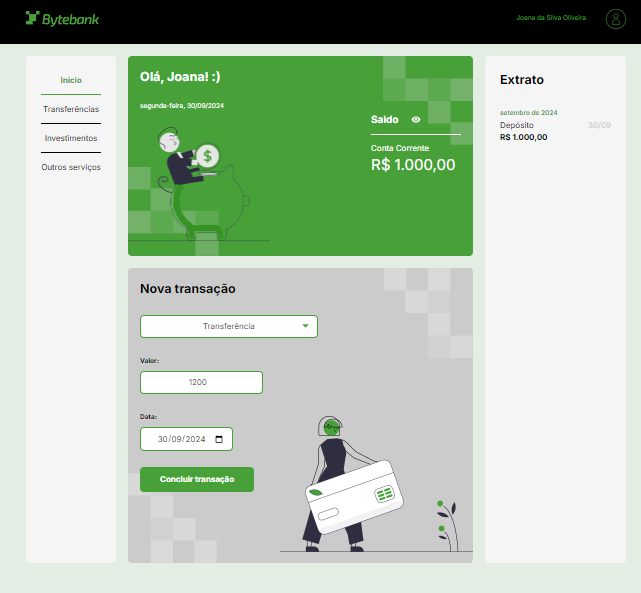

# Bytebank

https://byte-bank-sigma.vercel.app/

O Bytebank é um projeto que demonstra a aplicação do TypeScript em um sistema bancário simples. O objetivo é proporcionar uma compreensão prática dos conceitos e funcionalidades do TypeScript, promovendo boas práticas de programação.

## Funcionalidades

- **Gerenciamento de Saldo**: Permite realizar depósitos e saques, com validações para evitar saldo negativo e entradas inválidas.
- **Registro de Transações**: Mantém um histórico de todas as transações realizadas, facilitando o acompanhamento financeiro.
- **Organização Modular**: O código é estruturado em módulos, tornando-o mais legível e fácil de manter.

## Tecnologias Utilizadas

- **TypeScript**: Proporciona uma tipagem estática, tornando o código mais seguro e fácil de entender.
- **JavaScript**: Base do projeto, aproveitando suas funcionalidades modernas para a construção da aplicação.

## Contribuição

Contribuições são bem-vindas! Sinta-se à vontade para sugerir melhorias ou novas funcionalidades.

</img>
